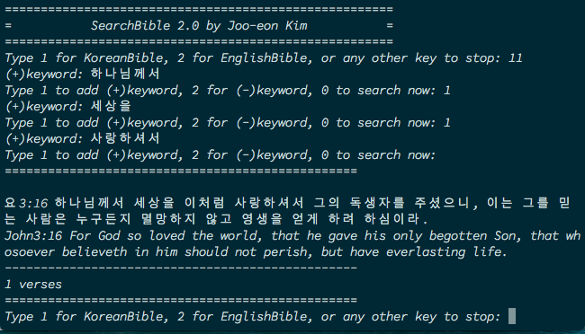

# Search_bible 2.0

- 1.0 은 C 로 짰었던 코드이고, 이것은 python 으로 작성한 코드이다. 
- 콘솔 입출력으로 돌아가는 프로그램이다
- `+` 와 `-` 검색이 가능하기 때문에, 반드시 포함시키고자 하는 단어와 빼고 싶은 단어를 설정할 수 있다.
- 한국어 성경을 바탕으로 한국어 검색을 할 수 있으며, 영어 성경을 바탕으로 영어 검색을 할 수 있다.

## python version
3.6.3

## 실행 화면
